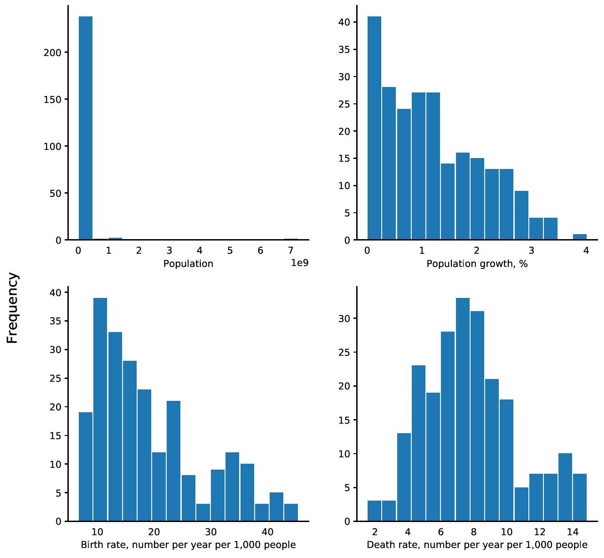

# Analysis of CIA Factbook Data

This is a guided project under Dataquest (Data Engineering track) where I analyzed a data set from the CIA World Factbook and provided insights on several demographic parameters. The [CIA World Factbook](https://www.cia.gov/library/publications/the-world-factbook/) is a compendium of statistics about all of the countries on Earth. 

My goals in the project are:

* Explore the data set and determine the columns that provide demographic information
* Provide summary statistics, e.g. maximum and minimum values, to demographic parameters
* Explore some of the outliers in the data set
* Graphically summarize the distribution of these demographic parameters

I performed the following methods for the data analysis:

* Opening and exploration of the `facts` table from the SQLite database `factbook.db`
* Determination of the columns that describe demographic information such as population, population growth, birth rate, death rate, land area, and water area
* Presentation of summary statistics, e.g. minimum and maximum values, for the demographic parameters
* Exploration of some outliers related to the population value
* Creation and discussion of histograms to graphically summarize the distribution of population, population growth, birth rate, and death rate
* Determination of population density and its distribution
* Determination of countries with more water area than land

Results of my data analysis show that:

* The majority of the countries have a population of not more than 500 million.
* The majority of the countries have a population growth of 3% and less.
* Most countries have a birth rate of 25 births per year per 1,000 people and less.
* The death rate of most countries falls from 3 - 10 deaths per year per 1,000 people.
* Macau is the most densely populated country at 21,169 people per km2.
* The majority of the countries have a population density of 2,000 people per km2 and less.
* Only 2 countries have more water area than land: British Indian Ocean Territory and the Virgin Islands.

Please see the `factbook.db` data set and the full exploratory data analysis in the Project 3.ipynb notebook above.
